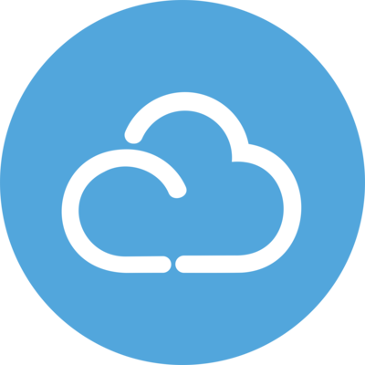
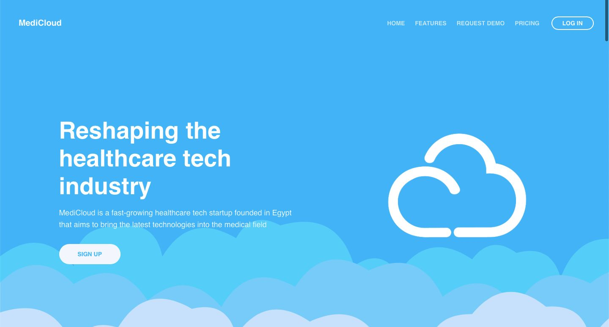
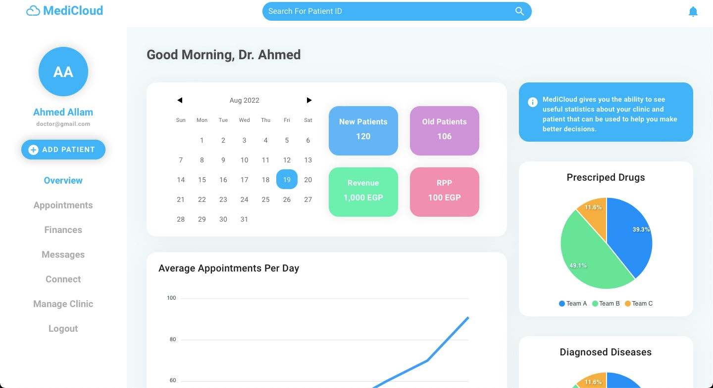
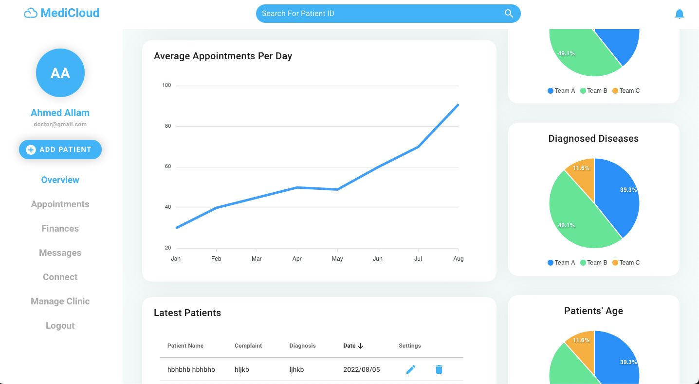
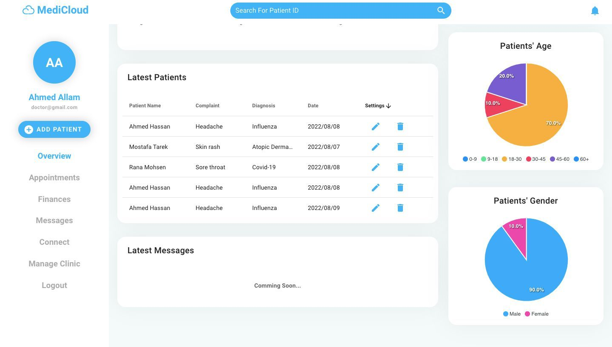
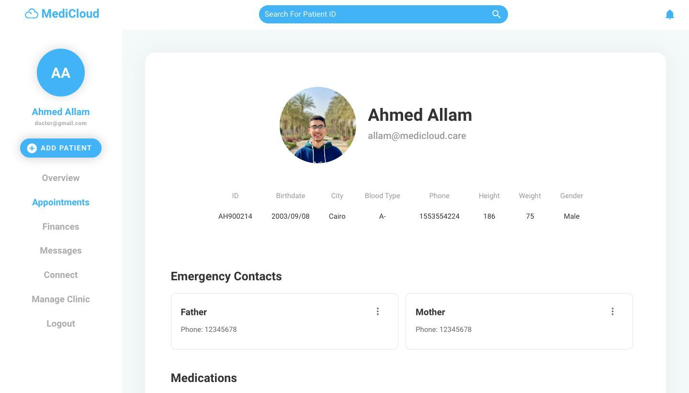
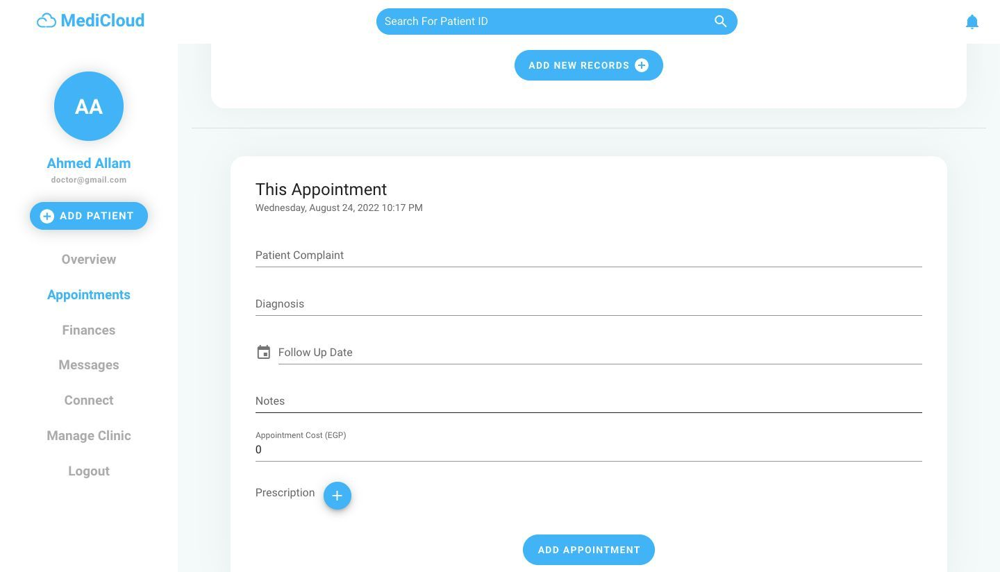

<!-- PROJECT SHIELDS -->
[![Contributors][contributors-shield]][contributors-url]
[![Forks][forks-shield]][forks-url]
[![Stargazers][stars-shield]][stars-url]
[![Issues][issues-shield]][issues-url]
[![MIT License][license-shield]][license-url]
[![LinkedIn][linkedin-shield]][linkedin-url]

<!-- PROJECT LOGO -->
 

  

<h3 align="center">MediCloud</h3>

  

<!--     <a href="https://github.com/ahmed-alllam/MediCloud-1.1">View Demo</a> -->
<!--     · -->
    <a href="https://github.com/ahmed-alllam/MediCloud-1.1/issues">Report Bug</a>
    ·
    <a href="https://github.com/ahmed-alllam/MediCloud-1.1/issues">Request Feature</a>
  

<!-- ABOUT THE PROJECT -->
## About The Project

**MediCloud is an early stage startup that aims to provide a cloud-based solution for medical records management. The system is designed to be used by both patients and doctors. Through our unified platform, patients can easily access their medical records and share them with their doctors through their app or their NFC-enabled card. Doctors can also access their patients' medical records and add new records to them. The system also provides a web-based dashboard for doctors to manage their patients' records and view their analytics.**

### Features:

1. Unified Medical Records Access:

   Access and manage medical records seamlessly through a unified cloud-based platform. Patients can securely view and share their records with doctors using the app or NFC-enabled cards.

2. Patient-Doctor Collaboration:

   Foster collaboration between patients and doctors. Patients can easily share medical records with their healthcare providers, while doctors can access patient records and add updates, ensuring a comprehensive view of patient health.

3. Web-Based Doctor Dashboard:

   Provide doctors with a comprehensive web-based dashboard for managing patient records. The dashboard offers tools to organize, analyze, and update medical information, helping doctors make informed decisions.

4. Analytics Insights:

   Enable doctors to gain valuable insights through analytics. The platform offers data-driven analysis, allowing doctors to track patient health trends, identify patterns, and make proactive recommendations for better patient care.

## Screenshots

    
    
    
    
    
    

## Tech Stack

* 
* 
* 
* 
* 

<!-- CONTACT -->
## Contact

Ahmed Allam - [LinkedIn][linkedin-url] - ahmedeallam@aucegypt.edu

<!-- MARKDOWN LINKS & IMAGES -->
[contributors-shield]: https://img.shields.io/github/contributors/ahmed-alllam/MediCloud-1.1.svg?style=for-the-badge
[contributors-url]: https://github.com/ahmed-alllam/MediCloud-1.1/graphs/contributors
[forks-shield]: https://img.shields.io/github/forks/ahmed-alllam/MediCloud-1.1.svg?style=for-the-badge
[forks-url]: https://github.com/ahmed-alllam/MediCloud-1.1/network/members
[stars-shield]: https://img.shields.io/github/stars/ahmed-alllam/MediCloud-1.1.svg?style=for-the-badge
[stars-url]: https://github.com/ahmed-alllam/MediCloud-1.1/stargazers
[issues-shield]: https://img.shields.io/github/issues/ahmed-alllam/MediCloud-1.1.svg?style=for-the-badge
[issues-url]: https://github.com/ahmed-alllam/MediCloud-1.1/issues
[license-shield]: https://img.shields.io/github/license/ahmed-alllam/MediCloud-1.1.svg?style=for-the-badge
[license-url]: https://github.com/ahmed-alllam/MediCloud-1.1/blob/master/LICENSE.txt
[linkedin-shield]: https://img.shields.io/badge/-LinkedIn-black.svg?style=for-the-badge&logo=linkedin&colorB=555
[linkedin-url]: https://linkedin.com/in/ahmed-e-allam
[product-screenshot]: images/screenshot.png
